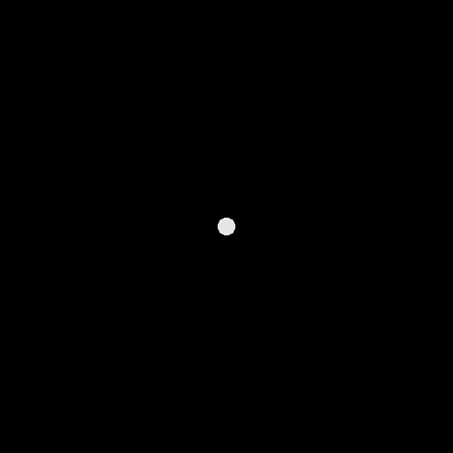
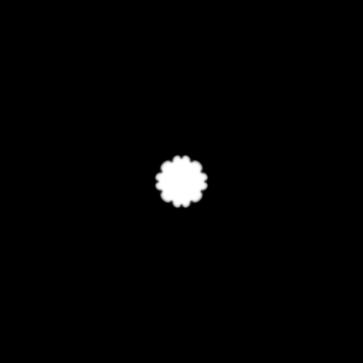

# phasepy
- **phasepy** is a package for running various simulations using the phase field method.
- The phase-field method follows the following Time-Dependent-Ginzburg-Landau(TDGL) equation.

> TDGL equation

 

## Simulation Content

### 1. Dendrite Simulation

Theory is [here](./doc/theory/dendrite.md)

> Governing equation

 

 

> 1-1. RoundCenterModel
 
Tutorial is [here](./doc/tutorial/dendrite/round_center.ipynb)

- This model simulates the generation of a **round** initial nucleus from the center
- Available for **ver.0.1.0** or later.

||||||
|-|-|-|-|-|
||||||

### Martensite Simulation

Planned Development...

### FSMA Simulation

Planned Development...